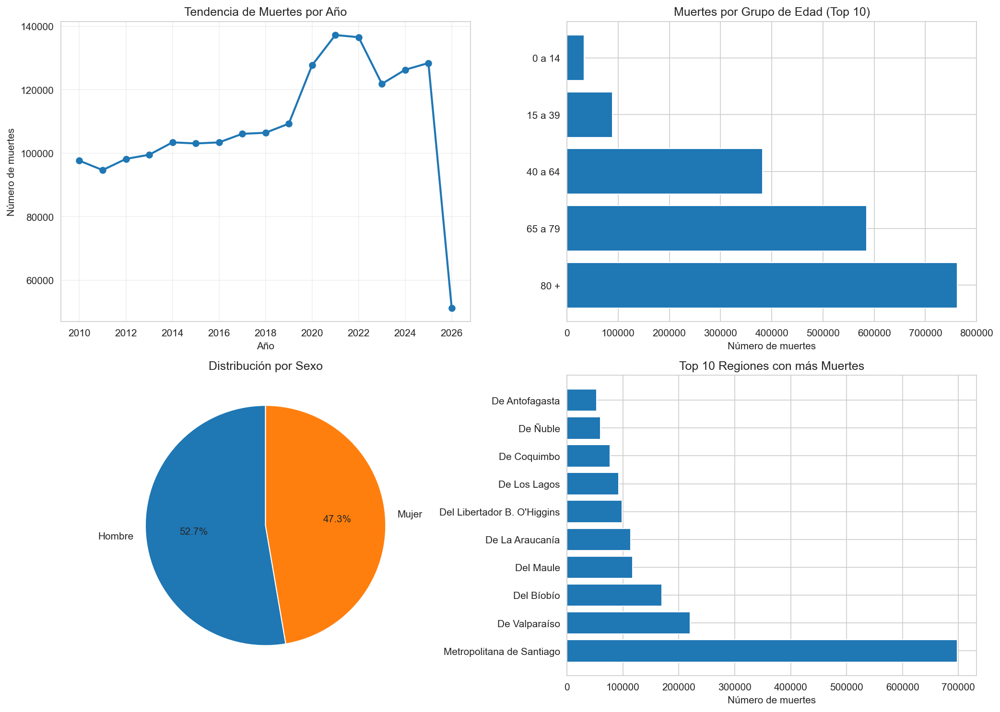

# 📊 Análisis Epidemiológico - Defunciones por Semana en Chile



## 📋 Descripción del proyecto

Este proyecto realiza **limpieza, transformación y análisis estadístico** de datos epidemiológicos de Chile, específicamente defunciones por semana epidemiológica. El dataset original contiene **141,920 registros** con información desagregada por año, semana, grupo de edad, sexo y región.

El objetivo es demostrar habilidades de **data cleaning** y **análisis exploratorio** en Python, transformando datos "sucios" en un reporte estructurado con visualizaciones profesionales.

---

## 🛠️ Tecnologías utilizadas

| Herramienta | Propósito |
|-------------|-----------|
| **Python 3.11** | Lenguaje principal |
| **Pandas** | Limpieza, transformación y agregación de datos |
| **Matplotlib + Seaborn** | Visualizaciones estadísticas |
| **SciPy** | Regresión lineal y prueba de significancia |
| **Git + GitHub** | Control de versiones y portafolio |

---

## 🔍 Problemas técnicos resueltos

El archivo original presentaba varios problemas comunes en datos reales:

| Problema | Solución implementada |
|----------|----------------------|
| Separador `||` en lugar de coma | `pd.read_csv(sep='|')` |
| Caracteres extraños (`á`, `ó`, `ñ`) | `.str.replace()` para normalizar a `á`, `ó`, `ñ` |
| Columna SEXO numérica (1,2) | Mapeo con diccionario: `{1: 'Hombre', 2: 'Mujer'}` |
| Tipos de datos mixtos | `pd.to_numeric(errors='coerce')` |

---

## 📈 Resultados del análisis

### Estadísticas generales
- **Total de registros procesados:** 141,920
- **Rango temporal:** Múltiples años de datos semanales
- **Dimensiones:** Año, semana, grupo de edad, sexo, región

### Visualizaciones generadas
El script produce automáticamente 4 gráficos:

1. **Tendencia de muertes por año** (línea de tiempo)
2. **Muertes por grupo de edad** (barras horizontales)
3. **Distribución por sexo** (gráfico circular)
4. **Top 10 regiones con más muertes** (barras horizontales)

### Análisis estadístico
- Cálculo de tasa de mortalidad por 100,000 habitantes
- Regresión lineal para detectar tendencia anual
- Prueba de significancia (p-value) para validar tendencias

---

## 🚀 Cómo ejecutar el proyecto

### Requisitos previos
- Conda o Miniconda instalado
- Entorno `gis` con las librerías necesarias

### Pasos de ejecución

```bash
# 1. Activar el entorno
conda activate gis

# 2. Ejecutar el script principal
python limpiar_analizar_epidemiologia.py

# 3. Ver resultados
- datos_epidemiologia_limpios.csv  # Datos procesados
- analisis_epidemiologico.png       # Visualización automática
Instalación de dependencias (si no tienes el entorno gis)
bash
conda create -n gis python=3.11 -y
conda activate gis
conda install pandas matplotlib seaborn scipy -c conda-forge -y

## 📂 Estructura del repositorio
text
analisis-epidemiologico-chile/
│
├── limpiar_analizar_epidemiologia.py   # Script principal
├── datos_epidemiologia_limpios.csv     # Datos procesados (salida)
├── def_semana_epidemiologica.csv       # Datos originales (entrada)
├── analisis_epidemiologico.png         # Visualización generada
├── .gitignore                          # Archivos excluidos
└── README.md                           # Este archivo

## 📊 Captura del resultado
https://analisis_epidemiologico.png

El script genera automáticamente este dashboard de 4 paneles.

## 👨‍💻 Autor
Jordan Esparza

GitHub: @sparza96

Proyecto: Análisis epidemiológico de defunciones en Chile

## 📅 Contexto del proyecto
Este ejercicio forma parte de un roadmap de aprendizaje para Data Analyst, donde se aplican conceptos de:

Limpieza de datos reales (data wrangling)

Estadística inferencial (pruebas t, regresión)

Visualización automatizada

Control de versiones con Git y GitHub

## 📝 Notas
Los datos originales provienen de fuentes oficiales de salud de Chile.

El archivo def_semana_epidemiologica.csv se incluye para reproducibilidad del análisis.

El script está diseñado para ser modular y fácilmente adaptable a otros datasets epidemiológicos.

## 📄 Licencia
Este proyecto es de uso educativo y demostrativo.